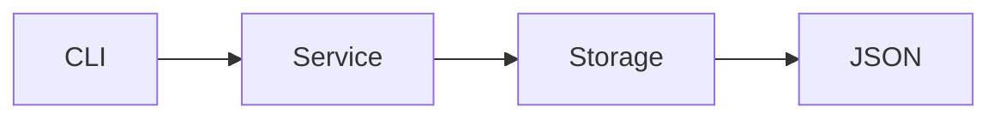

# Arquitectura del Sistema

# Estructura del proyecto

```
src/
 ├── app/
 │   ├── models/
 │   ├── services/
 │   └── storage/
```

---

# Principios aplicados

* Separación de responsabilidades
* Código limpio
* Funciones pequeñas
* Nombres descriptivos

---

# Decisiones de diseño

* Uso de `dataclasses` para los modelos
* Persistencia en JSON
* CLI como interfaz principal

---

# Flujo del sistema



---

