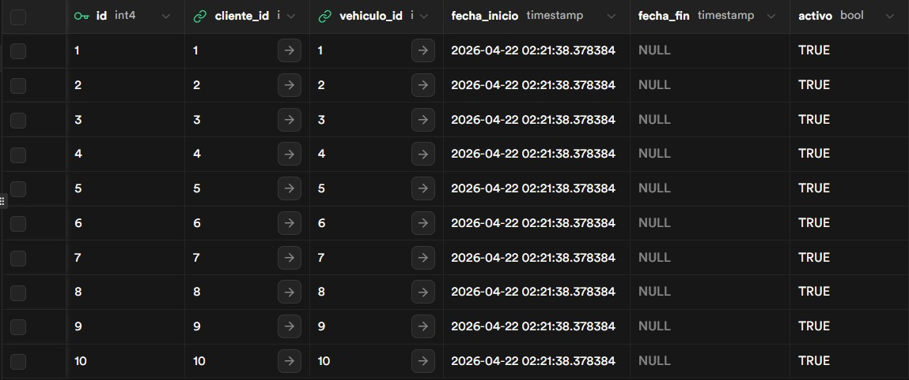
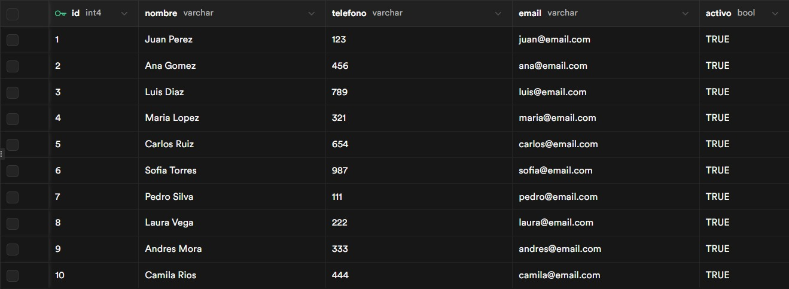
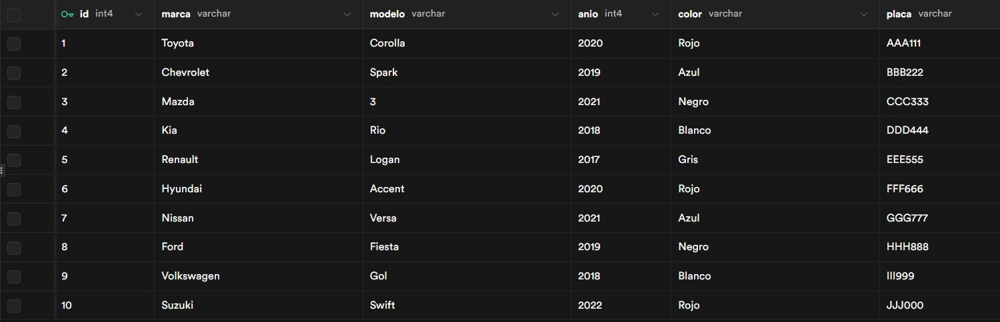
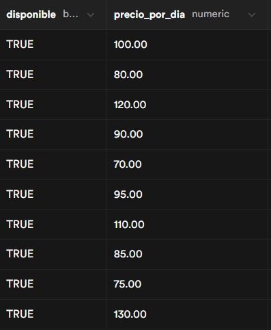

# Base de Datos

## Modelo Entidad-Relación

    CLIENTE {
        int id PK
        string nombre
        string telefono
        string email
        boolean activo
    }

    VEHICULO {
        int id PK
        string marca
        string modelo
        int anio
        string placa
        boolean disponible
        float precio_por_dia
    }

    ALQUILER {
        int id PK
        int cliente_id FK
        int vehiculo_id FK
        datetime fecha_inicio
        datetime fecha_fin
        boolean activo
    }

## Relaciones

- Un cliente puede realizar muchos alquileres (1 a muchos)
- Un vehículo puede estar en muchos alquileres (1 a muchos)

Esto genera una relación muchos a muchos entre cliente y vehículo.

## Integridad Referencial

Las claves foráneas garantizan que:

- No se puede registrar un alquiler con un cliente inexistente
- No se puede registrar un alquiler con un vehículo inexistente

## Evidencias

### Tabla Alquiler

### Tabla Cliente

### Tabla Vehiculo

